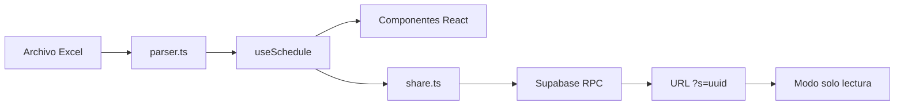

# ShiftSync — Mini SPA (producción)

Aplicación web de una sola página que lee un archivo Excel de turnos, muestra calendario, estadísticas y permite compartir un horario por enlace.

## Qué hace

1. El usuario sube un `.xlsx` / `.xls` (todo se parsea en el navegador con SheetJS).
2. Elige qué empleado ver (buscador con autocompletado).
3. Navega meses, calendario, agenda, próximo turno/descanso, compañeros de turno y estadísticas (texto + gráficas).
4. Opcional: guarda el horario en Supabase y obtiene un link `?s=<uuid>` de solo lectura para compartir.

El Excel **no** se sube al servidor; solo se envía a Supabase el horario ya parseado (JSON compacto) si el usuario pulsa «Guardar y generar enlace».

## Stack

| Capa | Tecnología |
|------|------------|
| UI | React 19, TypeScript, Tailwind CSS v4 |
| Build | Vite 6 |
| Excel | SheetJS (`xlsx` 0.20.3, CDN oficial) |
| Gráficas | Recharts |
| Persistencia / share | Supabase (Postgres + RPC) |
| Hosting | Vercel (estático, `dist/`) |

## Flujo de datos



## Modos de la app

| Modo | URL | Comportamiento |
|------|-----|----------------|
| **Edición** | `/` | Subir Excel, buscar empleado, compartir |
| **Solo lectura** | `/?s=<uuid>` | Carga horario desde Supabase; sin subida ni edición |

## Formato esperado del Excel

Por cada hoja (típicamente un mes):

- **Fila 1:** encabezados generales (ignorada para fechas).
- **Fila 2:** fechas en columnas desde la columna C (`raw: true`, tipo `Date`).
- **Filas 3+:** columna A = departamento, columna B = nombre, columnas C+ = turno del día.

Valores de celda reconocidos:

| Valor | Interpretación |
|-------|----------------|
| `Libre` | Día de descanso |
| `HH:MM - HH:MM` | Turno de trabajo (admite cruce de medianoche) |
| Texto con `VACAC` | Vacaciones |
| Otro / vacío | Sin datos (se avisa en banner) |

## Backend (Supabase)

Proyecto vinculado en producción. Esquema mínimo:

- **Tabla** `public.schedules`: `id` (uuid), `target_name`, `payload` (jsonb), `created_at`
- **RLS** activado sin políticas de lectura directa (solo vía RPC)
- **RPC** `create_schedule(target_name, payload)` → devuelve uuid
- **RPC** `get_schedule(id)` → devuelve fila

Seguridad del enlace compartido: quien tenga el UUID puede leer ese horario. No hay login de usuarios.

## Variables de entorno

Solo necesarias para **compartir** (sin ellas, el resto de la app funciona en local):

```env
VITE_SUPABASE_URL=https://<project-ref>.supabase.co
VITE_SUPABASE_ANON_KEY=<anon-key>
```

- Local: copiar a `.env.local` en la raíz (no commitear).
- Vercel: mismas variables en el proyecto, prefijo `VITE_` (se embeben en el build).

## Despliegue

1. Push a `master` en GitHub → Vercel despliega automáticamente (repo conectado).
2. Build: `npm run build` → salida en `dist/`.
3. Deploy manual alternativo: `vercel --prod`.

## Estructura relevante del código

```
src/
├── App.tsx              # Orquestación UI (modos edit / view)
├── hooks/useSchedule.ts # Estado global: archivo, empleado, mes, share
├── lib/
│   ├── parser.ts        # Excel → modelo (todos los empleados)
│   ├── stats.ts         # Métricas y búsqueda próximo turno/descanso
│   ├── share.ts         # Serializar / Supabase RPC
│   └── constants.ts     # Patrones, meta de estados, empleado por defecto
├── components/          # UI (Dashboard, Calendar, StatsCharts, ShareBar, …)
└── types.ts             # Tipos TypeScript
```

## Limitaciones actuales

- Sin autenticación; links compartidos son públicos para quien tenga el UUID.
- Cada «Guardar» crea un link nuevo (no actualiza uno existente).
- El empleado por defecto al cargar sigue definido en `constants.ts` (`TARGET_EMPLOYEE`).
- Métricas de «sueño» miden huecos entre turnos de trabajo consecutivos, no días calendario completos.
